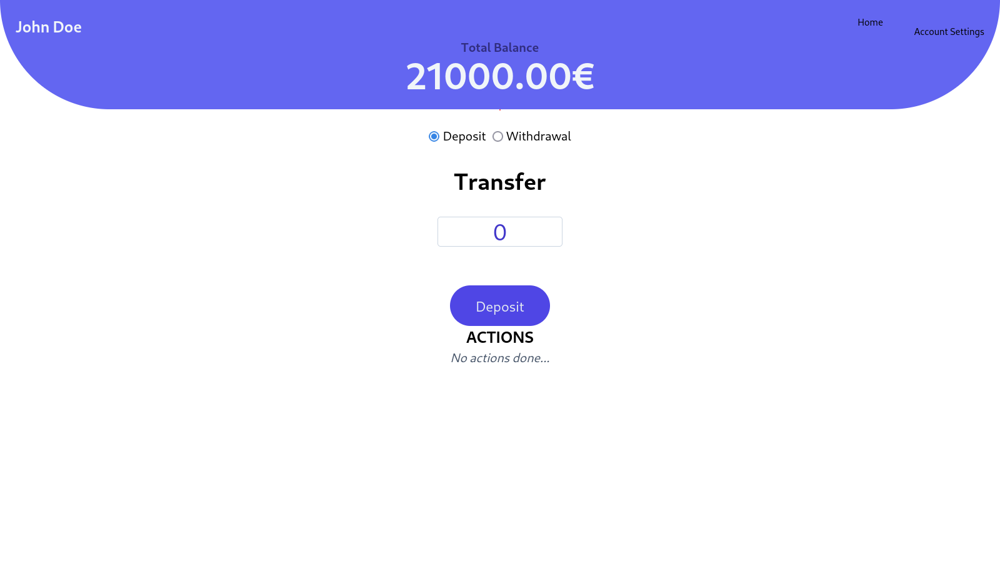

# BankApp_Vue

<!-- todo: add the preview after style -->



## :information_source: About  

This is a piece of a futur Bank App (front-end only) made using Vue 3,  

my new tool JavaScript for end of August 2024.


## :wrench: Tools
- [Vue 3.4.29](https://vuejs.org/ "Vue official website")
- [Vue Router 4.4.3](https://router.vuejs.org/ 'Vue Router official website')
- [Tailwindcss 3.4.10](https://tailwindcss.com/ "Tailwindcss official website")
- [Vite 5.3.1](https://vitejs.dev/ "Vite official website")


## :inbox_tray: Setup for contributions
1. Open a terminal and paste these lines
s
```bash
git clone git@github.com:loickcherimont/bank-app
```

2. Go in the project , fetch all dependencies and run it

```bash
cd ./bank-app
npm install
npm run dev
```

3. Welcome on the login page

## :warning: Prerequisites
To run correctly this project, you'll need Vue Router : [Vue Router 4.4.3](https://router.vuejs.org/ 'Vue Router official website')

## :thinking: How does it run ?
This is a banking app.  

User can deposit/withdraw and check all its account data.

> [!NOTE]
> A better version with more features is coming... 🏗️

## :test_tube: To Add

### Front
- Style the checkboxes
- If you can add some animations
- Add icon for deposit and withdraw (2 different ones)
- Recode `<Top />` again to reuse it for `<SettingView />`

### Back
- Prevent user to login without authentication (Go)
- Create a signup session

### Full-stack

- Login form 2 checking (FRONT/BACK)
- Add graphs using Chart.js or canvas -->


## :key: License

Developed by Loick Cherimont  

Under MIT License  

Last edition : 2024-09-06

